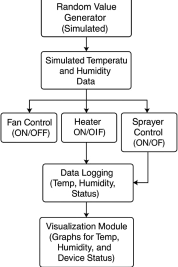

# Temperature and Humidity Control System Simulation

This project simulates a **Temperature and Humidity Control System** and visualizes the data with graphs in MATLAB. It demonstrates how to monitor environmental conditions and control actuators like fans, heaters, and sprayers based on set thresholds.

# Overview

The system simulates sensor readings for temperature and humidity, and activates/deactivates actuators accordingly:
- **Fan**: Turns ON if temperature is above a high threshold.
- **Heater**: Turns ON if temperature is below a low threshold.
- **Sprayer**: Turns ON if humidity falls below a low threshold.

The simulation runs for a predefined number of cycles (default is 10), and after the simulation, it plots:
- Temperature over time with thresholds marked.
- Humidity over time with a critical low threshold.
- Actuator status (ON/OFF) over time.

# Simulation Details

- **Temperature Range**: 15°C to 40°C
- **Humidity Range**: 30% to 90%
- **Temperature Thresholds**:
  - High: 30°C
  - Low: 18°C
- **Humidity Thresholds**:
  - Low: 40%

Each cycle generates a random temperature and humidity reading, controls the actuators based on the readings, and stores the data for later visualization.

# Graphs

### 1. Temperature Variation
- Line graph showing the temperature for each cycle.
- High and low temperature thresholds are indicated with dashed lines.

### 2. Humidity Variation
- Line graph showing the humidity for each cycle.
- Low humidity threshold is indicated with a dashed line.

### 3. Actuator Status
- Stairs plot showing ON (1) and OFF (0) status for each actuator (Fan, Heater, Sprayer) during each cycle.

  

# Features

- **Dynamic simulation** with real-time readings every second.
- **Automatic control** of fan, heater, and sprayer based on environmental conditions.
- **Visual representation** of environmental variations and actuator responses.

# How to Run

1. Copy the code into a new MATLAB script (e.g., `temp_humidity_simulation.m`).
2. Run the script in MATLAB.
3. Observe the command window outputs and generated graphs.

# Future Improvements

- Real-time animated plots updating after each cycle.
- Saving simulation data to a CSV file for future analysis.
- Incorporating real sensor data using external hardware.

# Conclusion

This MATLAB simulation models an effective way to manage a controlled environment by monitoring temperature and humidity, and automatically managing actuators. Such simulations are essential in understanding control systems used in industries like agriculture, HVAC systems, and greenhouses.

